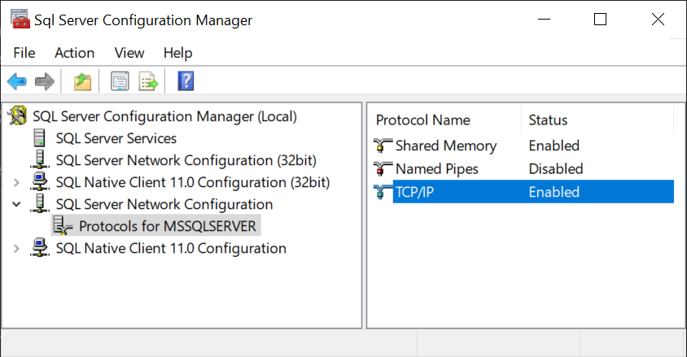
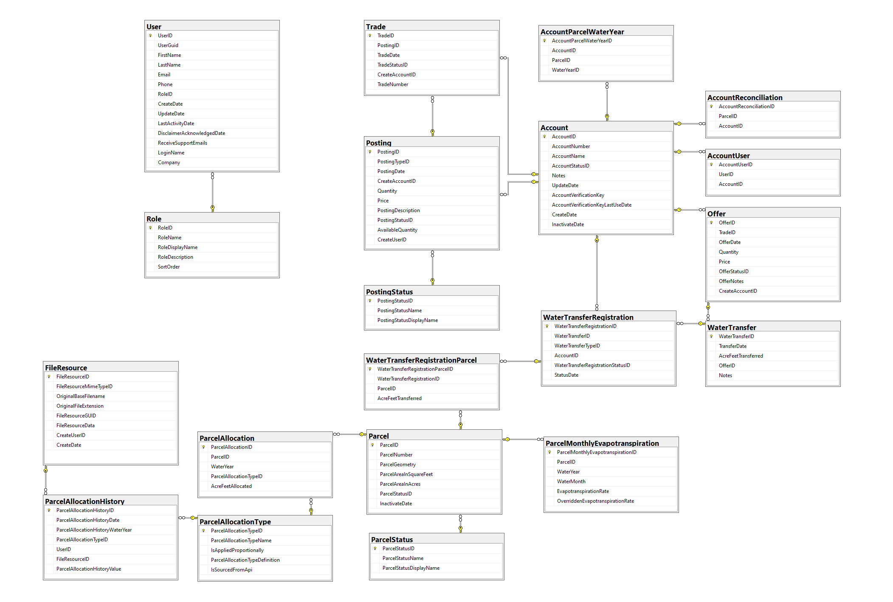

# Rosedale-Rio Bravo Water Storage District Water Trading Platform

[github](https://github.com/sitkatech/rio)

After following the instructions online you will run into some issues.

## Database

Accessing the database requires access to the SQL Server Configuration Manager which will allow to enable the TCP/IP access to your local SQL server.

To do that you need to install [SQL Server](https://www.microsoft.com/en-us/sql-server/sql-server-downloads) (I choose Developer edition).

Once installed you can Enable the TCP/IP Protocal as shown on the following screen shot.

After the database is created:

- Add a SQL login rio:dwqk#@(d39@(
- Add a User for the Above login can have the same name

## Starting the Server (API)

Problem starting the server
2021-10-14 16:59:36 +00:00 Fatal | -Microsoft.AspNetCore.Server.Kestrel: Unable to start Kestrel.

On Windows machine:
- clear dev-certs `dotnet dev-certs https --clean`
- generate new one `dotnet dev-certs https -ep /https/host.docker.internal.pfx -p password#1`

Start the server app
`dotnet /app/bin/Debug/net5.0/Rio.API.dll`

Installed SQL server PowerShell extension to execute DB scripts
Ran setup-db.bat for all scripts in the Database folder

Debug from Visual Studio
> Once the app is up and running in the container you can attach to the process by going to `Debug -> Attach to process`, select Docker (Linux container) and in the list bellow you should see the `dotnet` command line entered before

## Starting the client

A few changes to what's in the repository

To debug we do not need the Chrome extension.

With Visual Studio Code there is now an integrated Javascript debugger:
- Start a Javascript Debug Terminal
- From this terminal run the client `npm run start`
- Click on the `http://localhost:8787` link in the terminal output
- Debug session is now active, and you can set breakpoints

## Troubleshooting

### Failed to load resource: net::ERR_CERT_AUTHORITY_INVALID
You need to clear and recreate the dev certificate and relaunch the docker from the Rio solution.

# Design 

This is the schema of main tables of the current database (not included lookup tables and data tables)

## Make the app functional

Run a OpenStack Keystone for authentication and integrate it with the current solution.

## Database changes

Database should be adapted to allow multilatral trading also add UI and controllers to register.

We should also add table(s) to handle water rights, seniority, up/down stream information to account or parcels depending on how this is going to enter into consideration  

## Data 

We should use available resources to populate the data in the database to get to a point where the application can handle simple trade

## CronJob

Currently there are CronJobs executed in the app such as the OpenET job to update EvapoTransiration data.

This could be use to also update data from state or local departement on parcels, water rights, seniority, etc.

## How to integrate a market clearing algorithm written in python?

Let's say sellers and buyers place bids and we need to clear the market using an algorithm that exists in the Agent code. 

In step 1 in the python code, we could call a web service that will return all trades to clear + all information about buyers and sellers.

The agent would clear the transactions.

In the last step we would send the result of the market clearing algorithm to another web service for the results to be perform on the database.
